# 码跃 OJ（MaYue OJ）系统架构

> 主服务与 Sandbox 分离、判题走 Docker 的说明文档。下图使用 [Mermaid](https://mermaid.js.org/)，GitHub 可直接预览。

[English brief](#english-brief) · [目录](#目录)

---

## 目录

- [1. 项目概览](#1-项目概览)
- [2. 仓库结构](#2-仓库结构)
- [3. 系统上下文（C4 Level 1）](#3-系统上下文c4-level-1)
- [4. 容器架构（C4 Level 2）](#4-容器架构c4-level-2)
- [5. 部署架构](#5-部署架构)
- [6. 主业务服务内部结构](#6-主业务服务内部结构)
- [7. 判题沙箱服务内部结构](#7-判题沙箱服务内部结构)
- [8. 前端应用结构](#8-前端应用结构)
- [9. 核心时序：代码提交与判题](#9-核心时序代码提交与判题)
- [10. 核心时序：认证与会话](#10-核心时序认证与会话)
- [11. 核心时序：实时推送（SSE）](#11-核心时序实时推送sse)
- [12. 提交状态机](#12-提交状态机)
- [13. 数据模型](#13-数据模型)
- [14. Redis 使用一览](#14-redis-使用一览)
- [15. API 模块一览](#15-api-模块一览)
- [16. 技术栈](#16-技术栈)
- [17. 安全设计](#17-安全设计)
- [18. 配置与端口](#18-配置与端口)
- [19. 本地启动顺序](#19-本地启动顺序)
- [20. 演进路线（可选）](#20-演进路线可选)
- [English brief](#english-brief)

---

## 1. 项目概览

**码跃 OJ** 是一套前后端分离的在线判题平台（Online Judge），提供：

- 多语言编程题提交与 **Docker 沙箱评测**
- 竞赛、排行榜、签到与积分
- 技术博客、评论与站内通知
- 做题页 **AI 学习助手**（阿里云百炼，SSE 流式）

架构上采用 **主业务服务 + 独立判题沙箱服务**，通过 HTTP 解耦，便于扩展判题节点与资源隔离。

---

## 2. 仓库结构

```text
项目/
├── 前端/myoj/                 # Vue 3 + Vite 单页应用
│   ├── src/                   # 页面、组件、状态、API 封装
│   ├── generated/             # OpenAPI 自动生成 TypeScript 客户端
│   ├── public/                # 静态资源（favicon、品牌图等）
│   └── deploy/                # Nginx 配置示例
├── spingboot-init/            # 主业务 Spring Boot 服务
│   └── src/main/resources/db/ # MySQL 建表脚本
├── Sandbox/                   # 判题沙箱 Spring Boot 服务（Docker 执行）
└── docs/
    └── ARCHITECTURE.md        # 本文档
```

---

## 3. 系统上下文（C4 Level 1）

> 下图使用 GitHub 原生支持的 Mermaid `flowchart`。若需 C4 标准图，可将本节复制到 [Mermaid Live Editor](https://mermaid.live) 并启用 C4 插件。

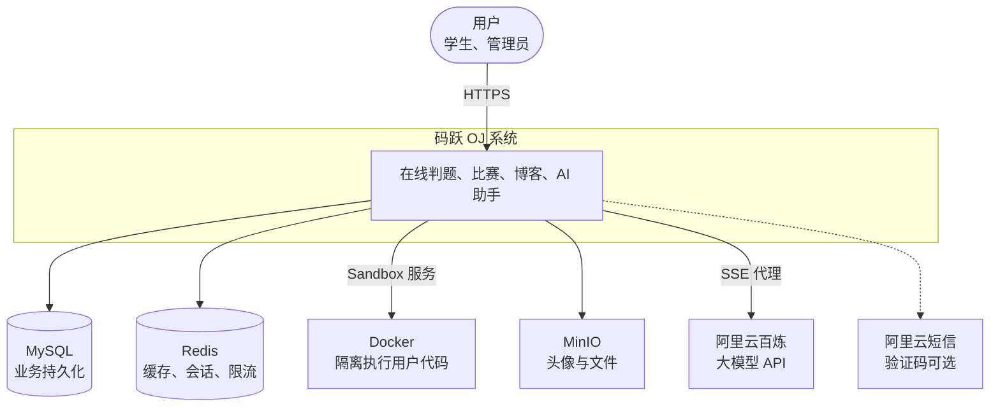

---

## 4. 容器架构（C4 Level 2）

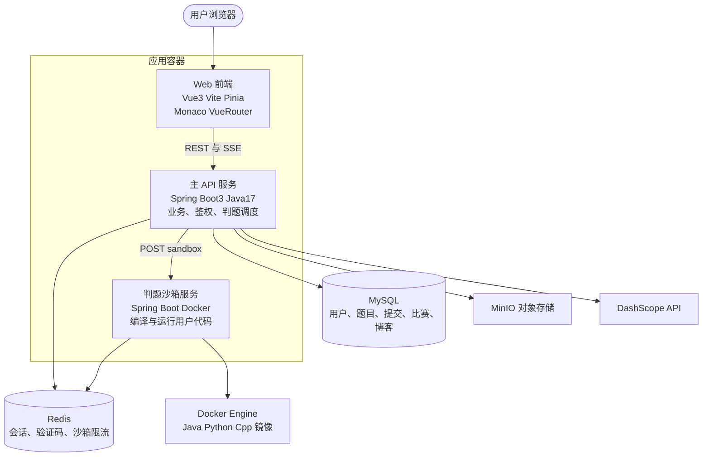

---

## 5. 部署架构

### 5.1 生产环境（推荐）

> **判题机**：Sandbox 与 **Docker Engine 建议部署在同一台 Linux 服务器**（或专用 Linux 判题节点）。主 API 可与 Sandbox 分机，但 Sandbox 所在机器必须是 Linux + Docker，否则无法隔离执行用户代码。

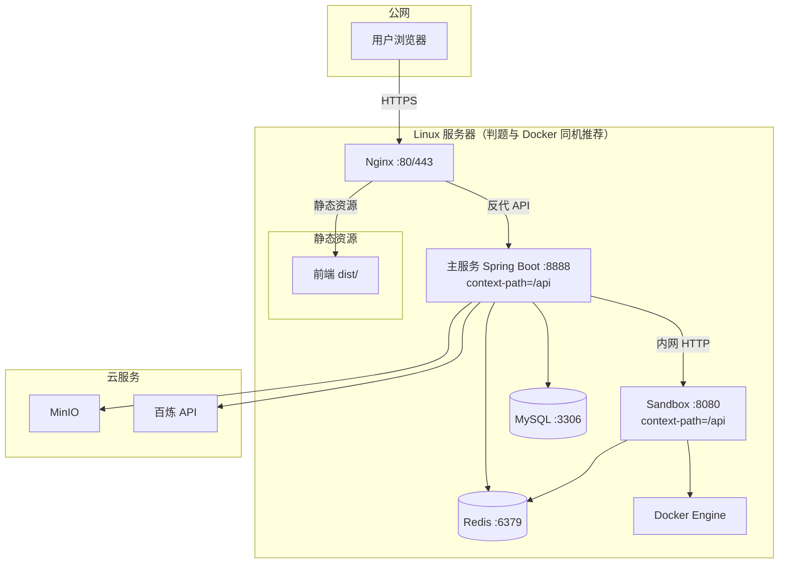

参考配置：`前端/myoj/deploy/nginx.myoj.conf`

### 5.1.1 判题机部署（Sandbox · 重要）

用户代码在 **Docker 容器** 中执行，因此：

| 场景 | 要求 |
|------|------|
| **生产 / 对外服务** | **Sandbox 必须部署在 Linux**，安装 Docker Engine；主服务通过 **内网 HTTP** 调用，勿将 Sandbox 端口暴露公网 |
| 本地开发 | 可在 Windows 使用 Docker Desktop 启动 Sandbox；主服务仍通过 HTTP 调 Sandbox |
| 主业务 API | 可不装 Docker；与 Sandbox 分机部署 |

判题镜像（见 `Sandbox/application.yml`）：`eclipse-temurin:17-jdk`、`python:3.11-slim`、`gcc:13`。

详细步骤见 **[Sandbox/README.md](../Sandbox/README.md)**。

### 5.2 本地开发环境

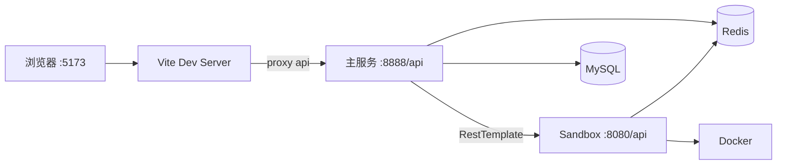

| 环境 | 前端入口 | API 基址 |
|------|----------|----------|
| 开发 | `http://localhost:5173` | Vite 代理 → `http://localhost:8888/api` |
| 生产 | Nginx 同域 | `https://域名/api` |

> **注意**：生产环境请使用 `npm run build` + Nginx 托管静态资源，不要用 `npm run dev` 对外暴露。

---

## 6. 主业务服务内部结构

**模块**：`spingboot-init`  
**根包**：`com.spingbootinit`

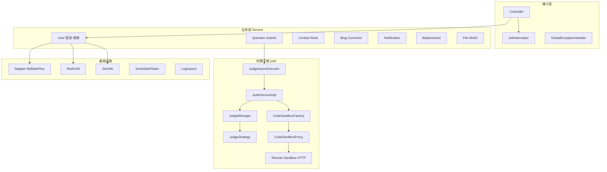

### 设计模式（面试可讲）

| 模式 | 位置 | 作用 |
|------|------|------|
| 工厂 | `CodeSandboxFactory` | 按配置选择 example / remote 沙箱实现 |
| 代理 | `CodeSandboxProxy` | 沙箱调用前后日志 |
| 策略 | `judo.strategy.*` | 多语言判题结果比对 |
| 模板方法 | Sandbox 侧 `AbstractTemplateCodeSandbox` | 固定「保存→编译→运行→清理」流程 |
| 异步 | `@Async` + `judgeTaskExecutor` | 提交接口快速返回 |

---

## 7. 判题沙箱服务内部结构

**模块**：`Sandbox`  
**入口**：`POST /api/sandbox`（Header `auth` 与配置 `sandbox.auth.key` 一致）

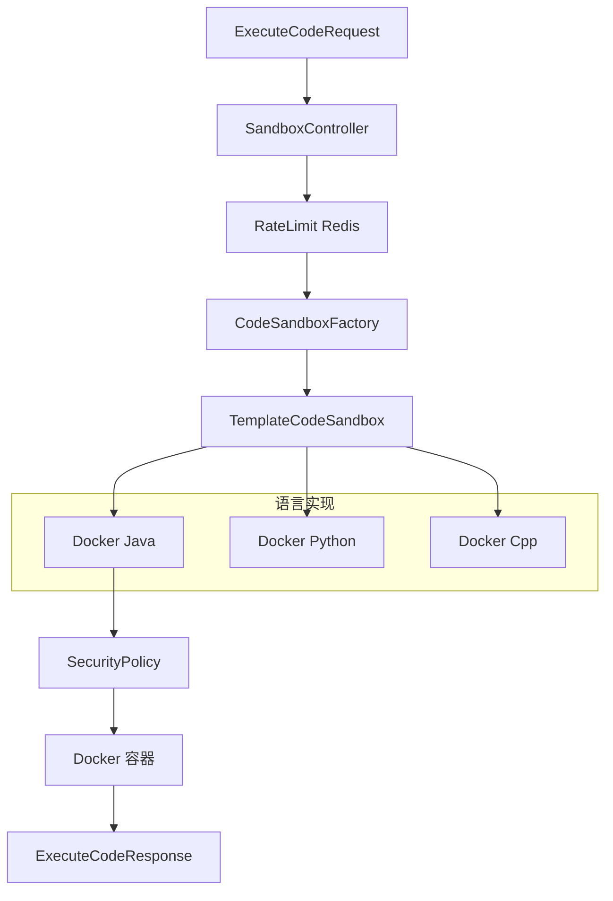

**执行约束**（见 `Sandbox/application.yml`）：

- 最大并发 `max-concurrent`
- 编译/运行超时
- 代码长度、用例数量上限
- Redis + 本地 fallback 双限流

---

## 8. 前端应用结构

**模块**：`前端/myoj`

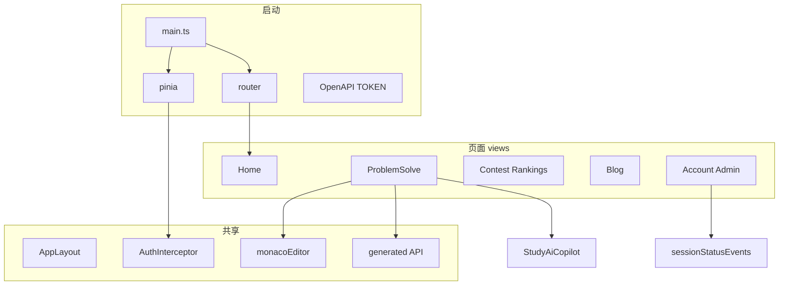

**请求通道**：

| 类型 | 实现 | 典型场景 |
|------|------|----------|
| REST | `@generated` + Axios | 题库、提交、博客 |
| SSE | `fetch` + ReadableStream | AI 助手 `bailianAssist.ts` |
| SSE | `EventSource` | 账号状态 `sessionStatusEvents.ts` |
| Blob | 原生 `fetch` | 图形验证码 |

---

## 9. 核心时序：代码提交与判题

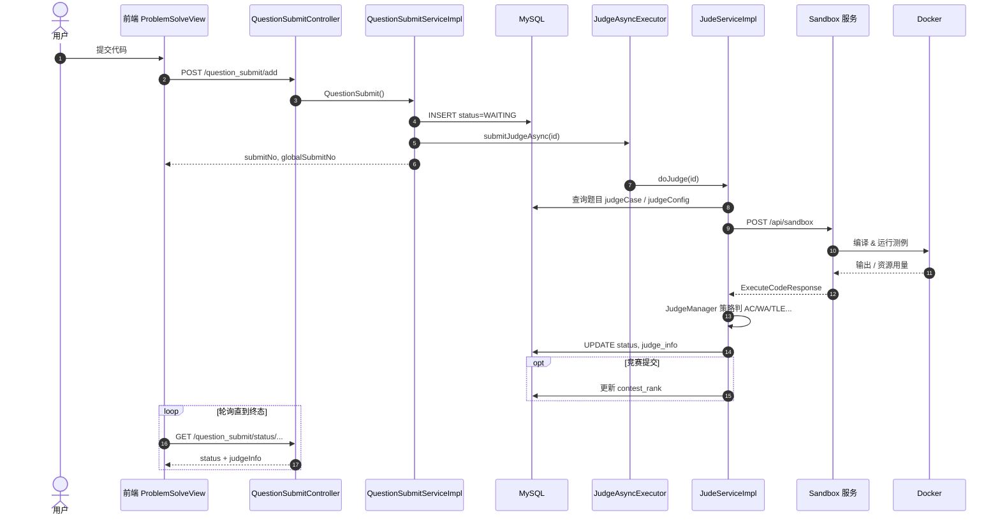

**关键源码路径**：

| 步骤 | 类 / 文件 |
|------|-----------|
| 接收入口 | `QuestionSubmitController` |
| 落库 + 触发异步 | `QuestionSubmitServiceImpl` |
| 异步执行 | `JudgeAsyncExecutor` → `JudeServiceImpl` |
| 远程沙箱 | `CodeSandboxFactory` → `ExampleCodeSandbox` |
| 沙箱执行 | `SandboxController` → `Docker*CodeSandbox` |
| 结果比对 | `JudgeManager` / `*LanguageJudgeStrategy` |

---

## 10. 核心时序：认证与会话

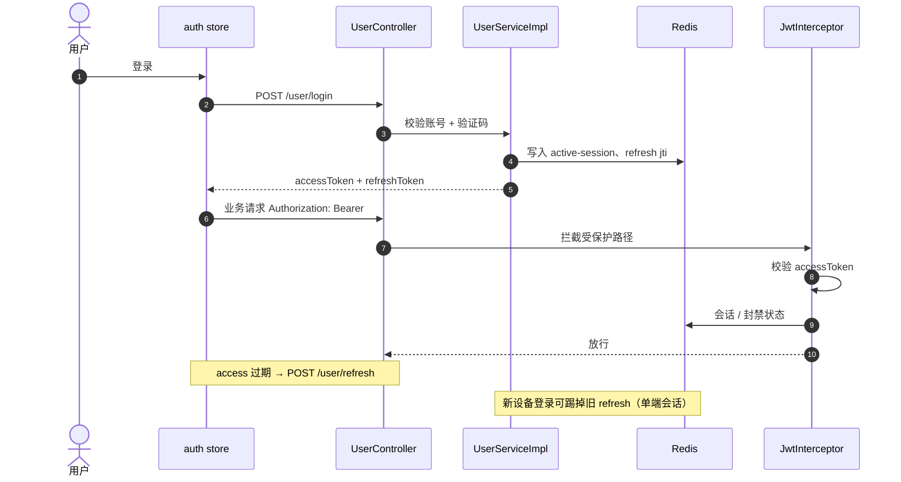

**JWT 双令牌**（`application.yml` → `jwt.*`）：

- **access**：API 鉴权，短期
- **refresh**：仅换票，长期；jti 存 Redis，支持作废与轮换

---

## 11. 核心时序：实时推送（SSE）

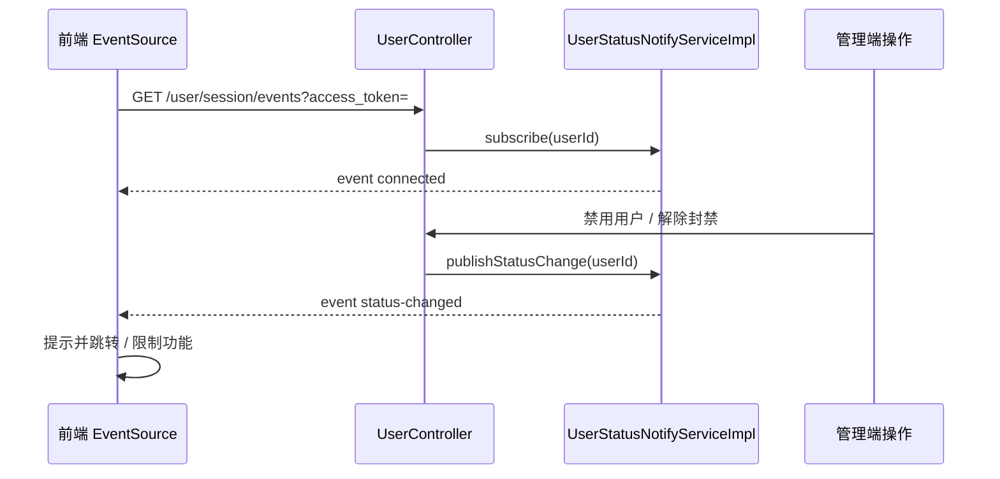

**AI 助手流式**（独立链路）：

`BailianAssistController` → `BailianAssistService.streamChat` → 转发百炼 `text/event-stream` → 前端 `bailianAssistChat()`（`fetch` 读流）。

---

## 12. 提交状态机

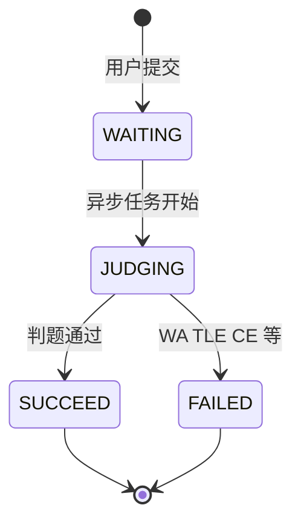

对应枚举：`QuestionSubmitStatusEnum`（表 `question_submit.status`）。

---

## 13. 数据模型

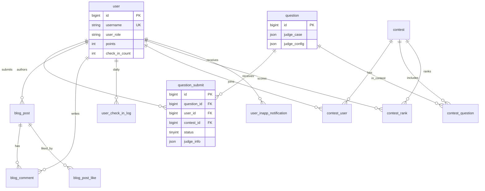

**建表脚本**（见 `spingboot-init/src/main/resources/db/README.md`）：

| 文件 | 说明 |
|------|------|
| `db/schema.sql` | **只跑这一个**：建表、旧库补列、admin 账号、示例竞赛 |

默认数据库名：`test`（与 `application.yml` 一致）。

---

## 14. Redis 使用一览

| 用途 | 说明 | 相关模块 |
|------|------|----------|
| 图形验证码 | 短期 KV | `CaptchaController` |
| 用户缓存 | 减少 DB 查询 | `UserServiceImpl` |
| 登录会话 | `auth:active-session:{userId}` | 单端互踢 |
| Refresh Token | `auth:refresh:{userId}:{jti}` | 换票与作废 |
| 沙箱限流 | 滑动窗口 / 计数 | `Sandbox` `RedisRateLimiter` |

> 生产环境请勿将 Redis 暴露公网；与 JWT `secret` 一样通过环境变量注入。

---

## 15. API 模块一览

> 以下路径均相对于 **`/api`**（`server.servlet.context-path`）。

| 前缀 | 职责 |
|------|------|
| `/user` | 注册登录、资料、签到、榜单、SSE 会话 |
| `/captcha` | 验证码 |
| `/question` | 题目 CRUD、分页、公开题面 |
| `/question_submit` | 提交、状态查询、记录列表 |
| `/contest` | 比赛列表、报名、提交校验 |
| `/contest/admin` | 比赛管理 |
| `/blog/post` | 博客 |
| `/blog/comment` | 评论 |
| `/notification` | 站内通知 |
| `/announcement` | 全站公告 |
| `/bailian_assist` | AI 助手（SSE） |
| `/code_validate` | 代码语法检查 |
| `/file` | 上传（MinIO） |

**沙箱服务**（独立进程）：

| 方法 | 路径 | 说明 |
|------|------|------|
| POST | `/api/sandbox` | 执行代码（需 `auth` 头） |

**文档**：启动主服务后访问 Knife4j → `/api/doc.html`

---

## 16. 技术栈

| 层级 | 技术 |
|------|------|
| 前端 | Vue 3, TypeScript, Vite, Pinia, Vue Router, Arco Design, Tailwind CSS, Monaco Editor |
| 主后端 | Java 17, Spring Boot 3.5, MyBatis-Plus, Spring Validation, AOP |
| 沙箱 | Spring Boot, Docker Java API, 模板方法 + 策略 |
| 数据 | MySQL 8, Redis |
| 契约 | OpenAPI 3 + springdoc + knife4j → 前端 `openapi-typescript-codegen` |
| 安全 | JWT (jjwt), BCrypt, 拦截器, 沙箱隔离 |
| 外部服务 | MinIO 对象存储、阿里云短信、百炼（DashScope 兼容模式） |
| 部署 | Nginx, 可选 Docker / 内网穿透（仅开发演示） |

---

## 17. 安全设计

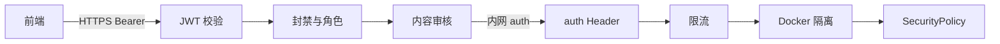

要点：

- 用户代码 **不在主 JVM 执行**，仅 Sandbox + Docker
- 沙箱接口 **共享密钥头** `auth`，应对内网或穿透 URL 做 IP 白名单
- 敏感配置（数据库、JWT、MinIO、API Key）使用 **环境变量**，勿提交仓库

---

## 18. 配置与端口

| 服务 | 默认端口 | Context Path |
|------|----------|----------------|
| 主业务 | `8888` | `/api` |
| Sandbox | `8080` | `/api` |
| 前端开发 | `5173` | `/` |
| MySQL | `3306` | — |
| Redis | `6379` | — |

**主服务关键配置**（`spingboot-init/src/main/resources/application.yml`）：

- `spring.datasource.*` — MySQL
- `spring.data.redis.*` — Redis
- `jwt.*` — 双令牌
- `codesandbox.type` — `example` | `remote` | `thirdParty`
- `bailian.*` — AI 助手（建议 `BAILIAN_ENABLED` + 环境变量 API Key）

**沙箱地址**：`codesandbox.url` / 环境变量 `SANDBOX_URL`（默认 `http://127.0.0.1:8080/api/sandbox`）；`codesandbox.auth-key` 与 Sandbox `sandbox.auth.key` 一致。

---

## 19. 本地启动顺序

```text
【判题机】生产环境：Sandbox 单独一台 Linux + Docker（见 Sandbox/README.md）

【本机联调】
1. 启动 MySQL，执行 db/schema.sql
2. 启动 Redis
3. 安装并启动 Docker（Windows：Docker Desktop；Linux：Docker Engine）
4. 启动 Sandbox（必须在能执行 docker 的环境）：
      cd Sandbox && mvn spring-boot:run    # 默认 :8080/api
5. 确认主服务 codesandbox.url 指向 Sandbox（或环境变量 SANDBOX_URL）
6. 启动主服务：cd spingboot-init && mvn spring-boot:run   # :8888/api
7. 启动前端：cd 前端/myoj && npm install && npm run dev     # :5173
8. 浏览器 http://localhost:5173 ，文档 http://localhost:8888/api/doc.html
```

仅启动主服务 **不会** 判题；未启动 Sandbox 时提交代码会失败或一直等待。

---

## 20. 演进路线（可选）

与 [HOJ](https://docs.hdoi.cn/introducition/architecture/) 等开源 OJ 对齐的常见下一步：

| 方向 | 说明 |
|------|------|
| Redis 判题队列 | 替换纯线程池，支持削峰与多 Sandbox 实例 |
| 判题结果 SSE | 减少前端轮询 |
| Elasticsearch | 全站搜索升级 |
| 可观测性 | Actuator + Prometheus + Grafana |
| Docker Compose | 一键拉起 MySQL / Redis / API / Sandbox / Nginx |

---

## English brief

**MaYue OJ** is a full-stack online judge: Vue 3 SPA, Spring Boot API, and a dedicated **Sandbox microservice** that runs untrusted code in **Docker**. Submissions are judged **asynchronously**; JWT + Redis handle auth and single-session policy. Optional features include contests, blogs, in-app notifications, check-in gamification, and an **SSE-based AI study assistant** (Alibaba Bailian).

For diagrams, see sections 3–12 above. Entry points: `spingboot-init` (business), `Sandbox` (execution), `前端/myoj` (UI).

---

## 文档维护

- 架构变更时请同步更新本文件与根目录 `README.md` 中的架构链接。
- 最后更新：2026-05
