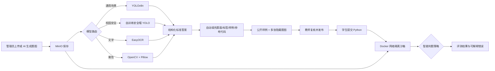

# 融合图像识别的智能化在线编程判题系统

## 一、系统定位

本项目不是把图片当作普通附件，而是把图像作为 OJ 测试输入。管理员上传或生成题图，识别服务生成可复核的标准答案；学生程序从标准输入读取沙箱内图片路径并输出约定格式；判题器依据题型采用精确匹配、数量容差、分类标签、检测框 IoU、OCR 编辑距离或数值容差进行评分。

## 二、总体流程



## 三、已实现能力

| 题型 | 模型或算法 | 学生输出 | 判题方式 |
|---|---|---|---|
| 传统文本题 | 编译运行 | 文本 | 去除行尾空白后匹配 |
| 目标计数 | YOLOv8n / 安全帽模型 | JSON 类别数量 | 单类别数量容差 |
| 图像分类 | YOLO 最高置信目标 | 类别标签 | 标签匹配 |
| 目标检测框 | YOLO | JSON 检测框 | 类别匹配 + IoU 阈值 |
| OCR | EasyOCR 中英文 | 单行文字 | 编辑距离容差 |
| 图像属性 | OpenCV / Pillow / NumPy | JSON 数值属性 | 数值绝对误差 |

模型键随题目持久化：`YOLO_GENERAL`、`YOLO_HELMET`、`EASYOCR_ZH_EN`、`OPENCV_ANALYSIS`。前端只展示与当前题型兼容的模型；后端再次校验，避免非法组合。

## 四、自训练模型实验

- 数据任务：安全帽场景目标检测，类别 `head`、`helmet`、`person`
- 基础模型：YOLOv8n
- 最优权重：`vision-ai/models/hard-hat-best.pt`
- 训练停止：第 91 轮提前停止，最优轮次 71
- 独立测试集：Precision 0.649、Recall 0.704、mAP50 0.676、mAP50-95 0.462
- 类别 mAP50-95：head 0.672、helmet 0.681、person 0.033

实验表明模型对 head 和 helmet 已具备可演示效果；person 类因标注样本不足明显偏弱。论文应如实展示类别不均衡、误检漏检案例，并将扩充 person 样本及消融实验列为改进方向。

## 五、部署与验收

1. Windows 启动识别服务：双击 `start-image-ai.bat`，确认 `http://127.0.0.1:8090/health`。
2. Ubuntu 判题机在仓库根目录构建镜像：

   ```bash
   docker build -t mayue-oj-python-vision:1.0 -f Sandbox/docker/python-vision/Dockerfile .
   ```

3. 启动 Sandbox、Redis、MySQL、MinIO 和主服务。主服务首次启动会为旧数据库自动增加 `question.vision_model_key`。
4. 管理端新建“图像目标计数题”，选择“校园安全检测”，上传公开样例图并点击“一键识别并生成题目”，然后批量上传至少一张不同的隐藏题图。AI 生成模式会自动产生 1 个公开样例和 2 个隐藏用例。
5. 核对检测框和标准输出后发布，在学生端补全系统提供的 Python 模板，先运行样例再提交。

系统只向学生返回标记为 `sample=true` 的用例。隐藏用例仍保存在题目的 `judge_case` JSON 中，只在正式判题时由主服务从可信 MinIO 下载并注入隔离容器，从而防止硬编码公开答案通过。

## 六、论文建议的对比实验

至少报告：不同置信度下的 Precision/Recall、YOLOv8n 与自训练模型在校园数据上的对比、数量精确匹配与容差判题的通过率、CPU 推理耗时、Docker 判题开销，以及 OCR 编辑距离阈值对判定结果的影响。每组实验保留数据规模、参数、硬件环境、结果表和典型失败案例，形成可复现证据。
