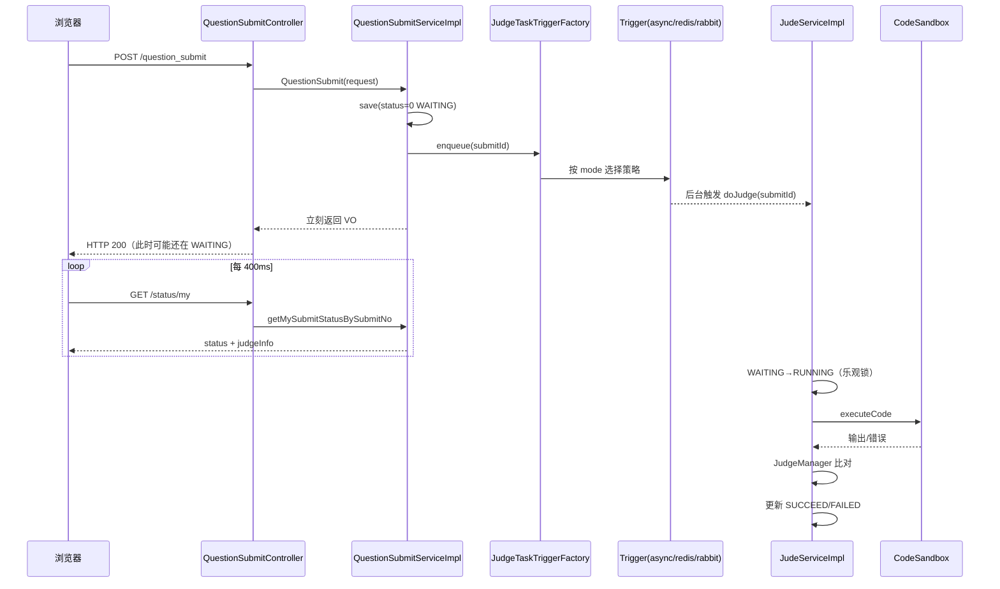

# 判题分发（MQ）完整学习手册

> 配套代码包：`com.spingbootinit.judo.mq`  
> 建议打印或在第二屏打开本文，边看边打断点。

---

## 第 0 章：你要学懂什么

### 0.1 一句话

用户提交代码后，系统**先落库**，再把 **`submitId` 这个编号** 交给后台去判题；  
`judo/mq` 包只负责「怎么把编号送过去」，**不负责**沙箱、比对、AC/WA。

### 0.2 两个层次（务必分开）

| 层次 | 包/类 | 职责 |
|------|--------|------|
| **运输层** | `judo/mq/*` | 异步触发：线程池 / Redis Stream / RabbitMQ |
| **业务层** | `JudeServiceImpl` | 查库 → 改状态 → 调沙箱 → 写结果 |

换 MQ 模式，**业务层一行不改**；这就是工厂 + 策略模式的价值。

### 0.3 提交状态机（前端轮询的就是它）

```
0 WAITING  待判题   ← save() 写入
    ↓ doJudge 乐观锁
1 RUNNING  判题中
    ↓ 沙箱 + 策略
2 SUCCEED  成功（judgeInfo 里可能是 Accepted）
3 FAILED   失败（CE/TLE/WA/系统错误等）
```

---

## 第 1 章：端到端时序（全链路）



---

## 第 2 章：逐文件精读

### 2.1 业务入口 — `QuestionSubmitServiceImpl`

**关键代码**（第 65、76-81 行）：

1. `status = WAITING(0)` — 此时还没开始判题  
2. `save()` 成功后拿到自增 `id`  
3. `judgeTaskTriggerFactory.enqueue(id)` — **唯一与 MQ 的接触点**

**为什么只传 `submitId`？**

- 代码、语言、题目信息已在 DB 的 `question_submit` 行里  
- MQ 消息越小越稳（重试、幂等、序列化都更简单）  
- `doJudge` 始终以 DB 为准，避免消息与 DB 不一致

**`@Lazy` 在工厂上**：打破循环依赖  
`SubmitService → Factory → AsyncExecutor → JudgeService → SubmitService`

---

### 2.2 工厂 — `JudgeTaskTriggerFactory`

```java
// 构造时：Spring 注入所有 JudgeTaskTrigger 实现
triggers = triggerList.stream()
    .collect(Collectors.toMap(JudgeTaskTrigger::type, ...));

// 运行时：读 yml 里的 mode，取对应策略
trigger = triggers.get(properties.getMode());
trigger.enqueue(submitId);
```

**启动日志**（必看）：

```
[判题分发] mode=async，可用策略=[async]
```

- `mode=redis-stream` 时，日志里应有 `[async, redis-stream]` 吗？  
  **不会** — 非当前模式的 Trigger 带 `@ConditionalOnProperty`，不会注册进 Spring，  
  所以 `可用策略` 通常**只有一个**。

---

### 2.3 策略接口 — `JudgeTaskTrigger`

```java
String type();           // 与 judge.mq.mode 字符串一致
void enqueue(Long submitId);
```

三种实现：

| type() 返回值 | 类 | 条件装配 |
|---------------|-----|----------|
| `async` | `AsyncJudgeTaskTrigger` | 始终存在 |
| `redis-stream` | `RedisStreamJudgeTaskTrigger` | mode=redis-stream |
| `rabbitmq` | `RabbitJudgeTaskTrigger` | mode=rabbitmq |

---

### 2.4 模式 A：async（入门必学）

**调用链**：

```
AsyncJudgeTaskTrigger.enqueue
  → JudgeAsyncExecutor.submitJudgeAsync  (@Async)
  → JudgeService.doJudge
```

**`AsyncConfig`**：独立线程池 `judgeTaskExecutor`  
- core=4, max=16, queue=500  
- 线程名前缀 `judge-async-`

**现象**：提交接口几十毫秒内返回；控制台线程名带 `judge-async-`。

**局限**：

- 任务在 JVM 内存队列里，**进程挂掉任务丢失**  
- 多机部署时每台机器各自线程池，**无法统一排队**

---

### 2.5 模式 B：redis-stream

**两个类**：

1. `RedisStreamJudgeTaskTrigger` — 薄封装，调 `publish`  
2. `RedisStreamJudgeMq` — **生产者 + 消费者合一**

#### 生产者 `publish`

```java
XADD judge:stream * submitId "123"
```

#### 消费者（应用启动时 `afterPropertiesSet`）

1. `XGROUP CREATE`（组已存在则忽略 BUSYGROUP）  
2. `StreamMessageListenerContainer` 轮询消费  
3. 收到消息 → `doJudge(submitId)` → **ACK**

#### Redis 概念对照

| Redis 命令 | 代码位置 | 含义 |
|------------|----------|------|
| XADD | `publish()` | 入队 |
| XGROUP CREATE | `createGroupIfAbsent()` | 消费者组 |
| XREADGROUP | `container.receive()` | 拉取消息 |
| XACK | `ack()` | 确认消费完成 |

**为什么用 Stream 而不是 List？**

- 支持**消费者组**、**ACK**、**Pending**（处理中未确认的消息）  
- 更适合「任务队列」语义

---

### 2.6 模式 C：rabbitmq

**三个类分工**：

| 类 | 角色 |
|----|------|
| `RabbitJudgeTaskTrigger` | 生产者：`convertAndSend(exchange, routingKey, submitId)` |
| `RabbitJudgeMqConfig` | 声明交换机、队列、绑定；配置 JSON 转换器 |
| `RabbitJudgeMqListener` | 消费者：`@RabbitListener` → `doJudge` |

#### Rabbit 模型

```
Producer → judge.exchange (Direct)
              ↓ routingKey=judge.submit
           judge.queue → Listener → doJudge
```

#### 为什么必须 JSON？

Spring AMQP 默认禁止 Java 原生反序列化（安全）。  
本项目用 `Jackson2JsonMessageConverter`，消息体是 JSON 数字，例如 `123`。

**切换 rabbitmq 前**：

1. `application.yml` 注释掉 `RabbitAutoConfiguration` 的 exclude  
2. 确保 Rabbit 服务可达  
3. 清空队列里**旧的 Java 序列化消息**（否则会反序列化失败）

---

### 2.7 判题核心 — `JudeServiceImpl.doJudge`

与 MQ **无关**，但三种模式最终都到这里。

**7 步流程**：

1. 按 id 查 `QuestionSubmit`、`Question`  
2. **乐观锁**：`WHERE status=0` 更新为 `1`，防重复判题  
3. 调沙箱 `executeCode`  
4. 沙箱致命错误 → 直接 FAILED  
5. `JudgeManager.doJudge` 比对输出  
6. AC → SUCCEED，否则 FAILED，写 `judgeInfo` JSON  
7. AC 时 `question.accepted_num + 1`

**并发保护**（第 90-99 行）：  
若两个消费者同时收到同一 submitId，只有一个能把 0→1 成功，另一个抛「已被处理」。

---

### 2.8 前端如何感知进度

`SubmissionsListView.vue`：

- 提交后 `pendingLiveStatus = 0 (WAITING)`  
- 每 **400ms** 调 `GET /question_submit/status/my`  
- 直到 status 为 2 或 3 停止轮询

后端 status 接口：`QuestionSubmitController.getSubmitStatusBySubmitNo`

---

## 第 3 章：设计模式与 Spring 机制

### 3.1 策略模式

- **Context**：`JudgeTaskTriggerFactory`  
- **Strategy**：`JudgeTaskTrigger` 三个实现  
- **切换方式**：改配置文件，不改 Java 代码

### 3.2 工厂模式

- 业务只依赖 `JudgeTaskTriggerFactory`  
- 具体 Trigger 由 Spring 收集并注入 List

### 3.3 条件装配 `@ConditionalOnProperty`

只有 `judge.mq.mode=redis-stream` 时才创建 `RedisStreamJudgeMq`，  
避免 async 模式下注入 Redis 监听器、或找不到 Bean。

### 3.4 `@Async` 原理（async 模式）

Spring 为 `JudgeAsyncExecutor` 生成代理；  
调用 `submitJudgeAsync` 时提交到 `judgeTaskExecutor` 线程池，调用方不等待。

### 3.5 `@Lazy` 与循环依赖

```
QuestionSubmitServiceImpl
  → JudgeTaskTriggerFactory
    → AsyncJudgeTaskTrigger
      → JudgeAsyncExecutor
        → JudeServiceImpl
          → QuestionSubmitService  ← 回到起点
```

`@Lazy` 延迟初始化，打破启动时的环。

---

## 第 4 章：三种模式对比表

| 维度 | async | redis-stream | rabbitmq |
|------|-------|--------------|----------|
| 外部依赖 | 无 | Redis | RabbitMQ |
| 消息持久化 | 否（内存队列） | 是 | 是 |
| 多实例消费 | 各自线程池 | 消费者组 | 竞争消费 |
| 学习难度 | ★ | ★★ | ★★★ |
| 适用场景 | 本地/单机 | 轻量队列、已有 Redis | 企业级 MQ |
| 最终判题 | doJudge | doJudge | doJudge |

---

## 第 5 章：针对性练习

> 每题都有「目标 / 操作 / 验收 / 参考答案要点」。  
> 建议按顺序做，做完一题再开下一题。

---

### 练习 1：断点跟读（async）【必做】

**目标**：建立「提交 → 入队 → 判题」肌肉记忆。

**操作**：

1. `judge.mq.mode: async`，重启后端  
2. 在以下位置打断点：  
   - `QuestionSubmitServiceImpl` 第 81 行 `enqueue`  
   - `JudgeTaskTriggerFactory.enqueue` 第 38 行  
   - `AsyncJudgeTaskTrigger.enqueue` 第 24 行  
   - `JudgeAsyncExecutor.submitJudgeAsync` 第 27 行  
   - `JudeServiceImpl.doJudge` 第 74 行  
3. 前端提交一题，F8 单步

**验收**：

- [ ] 能说出每一步在哪个线程（HTTP 线程 vs `judge-async-*`）  
- [ ] `doJudge` 执行前，DB 里 status 已是 0  
- [ ] 第一次进 `doJudge` 时，乐观锁把 status 改成 1

**要点**：`enqueue` 在 HTTP 线程；`doJudge` 在异步线程。

---

### 练习 2：观察状态与时间【必做】

**目标**：对齐 DB、日志、前端三处状态。

**操作**：

1. 打开 MySQL，执行：  
   `SELECT id, status, judge_info, create_time FROM question_submit ORDER BY id DESC LIMIT 5;`  
2. 提交一题，每隔 0.5 秒刷新 SQL  
3. 同时看前端提交列表和 IDEA 日志

**验收表格**（自己填）：

| 时刻 | DB status | 前端文案 | 日志关键词 |
|------|-----------|----------|------------|
| 刚提交 | | | |
| 1 秒内 | | | |
| 判题结束 | | | |

**要点**：前端 400ms 轮询，可能先看到 0 再看到 1 再看到 2/3。

---

### 练习 3：改错 mode【理解工厂】

**目标**：理解工厂校验。

**操作**：

1. 改 `judge.mq.mode: typo-mode`，重启  
2. 提交一题

**验收**：

- [ ] 提交接口报错，提示「未知 judge.mq.mode」  
- [ ] 能解释：工厂 `triggers.get(mode)` 得到 null

**恢复**：改回 `async`。

---

### 练习 4：redis-stream 入队验证【进阶】

**目标**：看见消息真的进了 Redis。

**操作**：

1. 改 `mode: redis-stream`，重启  
2. 启动日志应有 `[Redis Stream] 监听已启动`  
3. 提交一题  
4. Redis CLI：  
   ```bash
   XLEN judge:stream
   XRANGE judge:stream - + COUNT 3
   XINFO GROUPS judge:stream
   ```

**验收**：

- [ ] 日志有 `[Redis Stream] 入队 key=..., submitId=...`  
- [ ] Stream 里有 submitId 字段  
- [ ] 判题完成后消息被 ACK（Pending 不堆积）

**思考题**：如果 `doJudge` 抛异常且没有 ACK，消息会怎样？  
→ 留在 Pending，可 XAUTOCLAIM 重试（本项目 catch 后只打日志，需知悉）。

---

### 练习 5：rabbitmq 管理台【进阶】

**目标**：理解 exchange → queue → consumer。

**操作**：

1. 注释 exclude，改 `mode: rabbitmq`，重启  
2. 打开 `http://192.168.136.128:15672`  
3. 提交一题，看 `judge.queue` 的 Ready / Unacked / Total

**验收**：

- [ ] 日志 `[RabbitMQ] 入队 exchange=judge.exchange...`  
- [ ] 队列 briefly 有消息然后被消费  
- [ ] 判题结果正常

---

### 练习 6：乐观锁实验【理解并发】

**目标**：理解 `WAITING→RUNNING` 防重。

**操作**（仅本地测试）：

1. 在 `JudeServiceImpl.doJudge` 第 102 行后加断点，暂停 30 秒  
2. 用 Redis/Rabbit 模式，**手动**再触发一次同一 submitId 的 `doJudge`（或写临时测试接口）

**验收**：

- [ ] 第二次更新 status 失败，日志「判题并发冲突」

**要点**：MQ 至少一次投递 + 乐观锁 = 不会重复判题两次。

---

### 练习 7：只传 submitId 的好处【概念】

**目标**：口述设计理由。

**不用写代码**，回答：

1. 若 MQ 消息里带完整 code，改代码后再消费旧消息会怎样？  
2. 若服务重启，async 模式未判完的任务去哪了？redis-stream 呢？

**参考**：

1. 可能用旧代码判题，与 DB 不一致  
2. async 丢失；redis/rabbit 消息仍在，重启后可继续消费

---

### 练习 8：画架构图【综合】

**目标**：能向别人讲清楚。

**操作**：用纸或 draw.io 画：

- 三个方框：Controller / mq 包 / JudeServiceImpl  
- 三种 mode 用不同颜色箭头汇入同一个 `doJudge`

**验收**：给同学或对着镜子讲 3 分钟，不卡壳。

---

### 练习 9：面试题自测【综合】

不看代码，写下答案后再对照本文。

1. 为什么提交接口要异步判题？  
2. 工厂模式和策略模式在本项目里分别体现在哪？  
3. `@ConditionalOnProperty` 不用会怎样？  
4. 前端怎么知道判题完成？为什么不用 WebSocket？  
5. 生产环境你会选哪种 mode？为什么？

---

### 练习 10：小改造（可选挑战）【动手】

**目标**：验证真懂扩展点。

**任务 A**：在 `JudgeTaskTriggerFactory.enqueue` 打日志，记录 mode + submitId + 耗时。  

**任务 B**：给 redis-stream 的 `handleMessage` 失败时增加「不 ACK」注释说明，并查 Redis `XPENDING judge:stream judge-group`。  

**任务 C**：思考：若要做「延迟判题 5 秒」，应在哪一层加 DelayQueue / Rabbit TTL？

---

## 第 6 章：常见问题 FAQ

**Q：改了 mode 没生效？**  
A：必须重启 Spring Boot；`@ConditionalOnProperty` 在启动时决定 Bean。

**Q：async 模式下还有 Redis 连接错误？**  
A：验证码等功能仍用 Redis；与判题 mode 无关。

**Q：Rabbit 报 SecurityException / 反序列化失败？**  
A：队列里有旧格式消息，Purge Queue；确认 JSON Converter 已配置。

**Q：前端一直 WAITING？**  
A：查后端是否报错、Sandbox 是否可达、`doJudge` 是否被调用。

**Q：status=2 但显示 WA？**  
A：`SUCCEED` 表示判题流程成功结束；AC/WA 在 `judge_info.message` 里。

---

## 第 7 章：学习路线（7 天）

| 天 | 任务 |
|----|------|
| D1 | 练习 1 + 2（async 断点 + 状态表） |
| D2 | 精读第 2 章 2.1–2.4，做练习 3 |
| D3 | redis-stream：练习 4 + 读 `RedisStreamJudgeMq` |
| D4 | rabbitmq：练习 5 + 读三个 rabbit 类 |
| D5 | 精读 `JudeServiceImpl`，做练习 6 |
| D6 | 练习 7–9 |
| D7 | 练习 8 + 10，用自己的话写 500 字总结 |

---

## 附录：关键文件速查

| 文件 | 行号提示 |
|------|----------|
| `QuestionSubmitServiceImpl` | 65 WAITING，81 enqueue |
| `JudgeTaskTriggerFactory` | 38 enqueue，39 resolve |
| `JudeServiceImpl` | 90-99 乐观锁，130 沙箱，160 策略 |
| `RedisStreamJudgeMq` | 50 publish，99 handleMessage |
| `RabbitJudgeTaskTrigger` | 36 convertAndSend |
| `RabbitJudgeMqListener` | 28 onMessage |
| `QuestionSubmitController` | 45 POST，66 GET status |
| `application.yml` | judge.mq.mode |

---

*学完标准：能独立切换三种 mode、能画时序图、能解释为何只传 submitId、能回答面试 5 题。*
